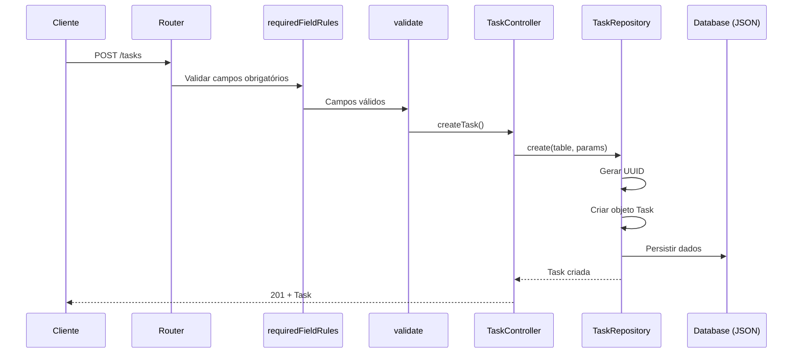
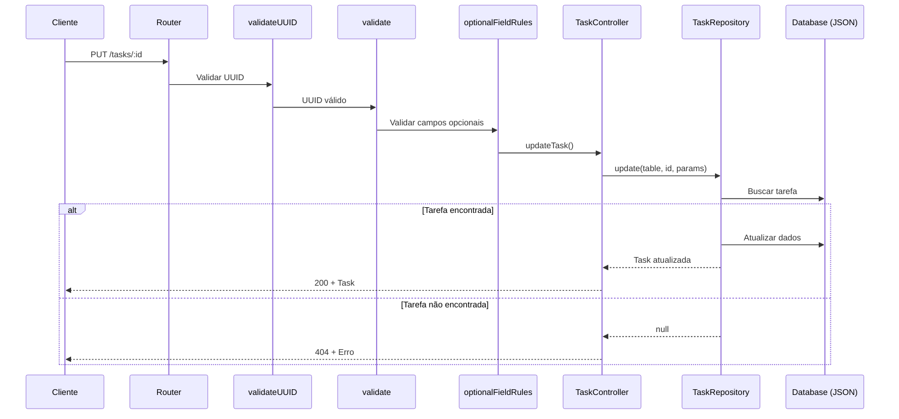
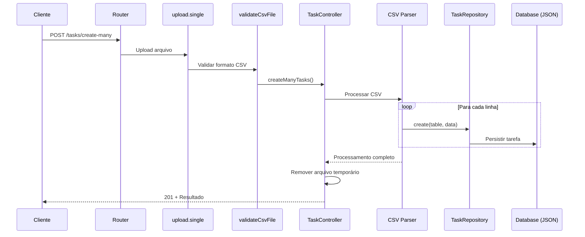

# Design Document - Task Management API

## Visão Geral

Esta API foi desenvolvida para gerenciar tarefas (tasks) com operações CRUD completas, incluindo importação em lote via arquivo CSV. A aplicação utiliza Node.js com TypeScript, Express.js e armazenamento em arquivo JSON.

## Arquitetura

### Padrão de Arquitetura

- **Arquitetura em Camadas**: Controller → Repository → Model
- **Padrão Repository**: Abstração da camada de dados
- **Middleware Pattern**: Validação e processamento de requisições

### Estrutura do Projeto

```
src/
├── app/
│   ├── controllers/     # Lógica de negócio e controle de requisições
│   ├── middlewares/     # Validações e processamento de dados
│   ├── models/          # Definições de tipos e interfaces
│   ├── repositories/    # Camada de acesso a dados
│   └── routes/          # Definição de rotas
├── database/            # Armazenamento de dados (JSON)
├── utils/               # Configurações e utilitários
└── main.ts             # Ponto de entrada da aplicação
```

## Modelos de Dados

### Task Interface

```typescript
interface Task {
  id: Id; // UUID único
  title: string; // Título da tarefa (5-150 caracteres)
  description: string; // Descrição da tarefa (máx 550 caracteres)
  completed_at: Date | null; // Data de conclusão (null se não concluída)
  created_at: Date; // Data de criação
  updated_at: Date; // Data da última atualização
}
```

### Tipos Auxiliares

```typescript
type Id = string;
type DatabaseTable = "tasks";

interface CreateTaskParams {
  title: string;
  description: string;
}

interface UpdateTaskParams {
  title?: string;
  description?: string;
}
```

## Rotas da API

### 1. Listar Tarefas

- **Método**: `GET`
- **Endpoint**: `/tasks`
- **Descrição**: Retorna todas as tarefas cadastradas
- **Parâmetros**: Nenhum
- **Resposta de Sucesso**:
  ```json
  {
    "status": "Ok",
    "details": Task[]
  }
  ```
- **Códigos de Status**: 200 (OK), 500 (Erro interno)

### 2. Criar Tarefa

- **Método**: `POST`
- **Endpoint**: `/tasks`
- **Descrição**: Cria uma nova tarefa
- **Middlewares**: `requiredFieldRules`, `validate`
- **Body**:
  ```json
  {
    "title": "string (5-150 caracteres)",
    "description": "string (máx 550 caracteres)"
  }
  ```
- **Resposta de Sucesso**:
  ```json
  {
    "status": "OK",
    "details": Task
  }
  ```
- **Códigos de Status**: 201 (Criado), 422 (Dados inválidos), 500 (Erro interno)

### 3. Criar Múltiplas Tarefas (CSV)

- **Método**: `POST`
- **Endpoint**: `/tasks/create-many`
- **Descrição**: Importa tarefas de um arquivo CSV
- **Middlewares**: `upload.single("file")`, `validateCsvFile`
- **Body**: `multipart/form-data` com arquivo CSV
- **Formato CSV**:
  ```csv
  title,description
  "Título da tarefa","Descrição da tarefa"
  ```
- **Resposta de Sucesso**:
  ```json
  {
    "status": "OK",
    "message": "IMPORTED_SUCCESSFULLY",
    "imported": number
  }
  ```
- **Códigos de Status**: 201 (Criado), 400 (Arquivo inválido), 500 (Erro interno)

### 4. Atualizar Tarefa

- **Método**: `PUT`
- **Endpoint**: `/tasks/:id`
- **Descrição**: Atualiza uma tarefa existente
- **Middlewares**: `validateUUID`, `validate`, `optionalFieldRules`
- **Parâmetros de URL**: `id` (UUID)
- **Body**:
  ```json
  {
    "title": "string (5-150 caracteres, opcional)",
    "description": "string (máx 550 caracteres, opcional)"
  }
  ```
- **Resposta de Sucesso**:
  ```json
  {
    "status": "OK",
    "details": Task
  }
  ```
- **Códigos de Status**: 200 (OK), 400 (ID inválido), 404 (Tarefa não encontrada), 422 (Dados inválidos), 500 (Erro interno)

### 5. Marcar como Concluída

- **Método**: `PATCH`
- **Endpoint**: `/tasks/:id/completed`
- **Descrição**: Marca/desmarca uma tarefa como concluída
- **Middlewares**: `validateUUID`, `validate`
- **Parâmetros de URL**: `id` (UUID)
- **Body**: Nenhum
- **Resposta de Sucesso**:
  ```json
  {
    "status": "OK",
    "details": Task
  }
  ```
- **Códigos de Status**: 200 (OK), 400 (ID inválido), 404 (Tarefa não encontrada), 500 (Erro interno)

### 6. Deletar Tarefa

- **Método**: `DELETE`
- **Endpoint**: `/tasks/:id`
- **Descrição**: Remove uma tarefa
- **Middlewares**: `validateUUID`, `validate`
- **Parâmetros de URL**: `id` (UUID)
- **Body**: Nenhum
- **Resposta de Sucesso**:
  ```json
  {
    "status": "OK",
    "details": Task
  }
  ```
- **Códigos de Status**: 200 (OK), 400 (ID inválido), 404 (Tarefa não encontrada), 500 (Erro interno)

## Middlewares

### Validação de Campos Obrigatórios (`requiredFieldRules`)

- Valida `title` (obrigatório, string, 5-150 caracteres)
- Valida `description` (obrigatório, string, máx 550 caracteres)

### Validação de Campos Opcionais (`optionalFieldRules`)

- Valida `title` (opcional, string, 5-150 caracteres)
- Valida `description` (opcional, string, máx 550 caracteres)

### Validação de UUID (`validateUUID`)

- Verifica se o parâmetro `id` é um UUID válido

### Validação Geral (`validate`)

- Processa resultados das validações do express-validator
- Retorna erros formatados em caso de falha

### Upload de CSV (`upload`)

- Configuração do Multer para upload de arquivos
- Armazenamento temporário em `src/tmp/`

### Validação de Arquivo CSV (`validateCsvFile`)

- Verifica se arquivo foi enviado
- Valida tipo MIME (text/csv ou application/vnd.ms-excel)

## Códigos de Erro

### Validação de Campos

- `TITLE_REQUIRED`: Título é obrigatório
- `TITLE_INVALID`: Título deve ser string
- `TITLE_MIN_LENGTH`: Título deve ter pelo menos 5 caracteres
- `TITLE_MAX_LENGTH`: Título deve ter no máximo 150 caracteres
- `DESCRIPTION_REQUIRED`: Descrição é obrigatória
- `DESCRIPTION_INVALID`: Descrição deve ser string
- `DESCRIPTION_MAX_LENGTH`: Descrição deve ter no máximo 550 caracteres

### Validação de Arquivo

- `CSV_FILE_REQUIRED`: Arquivo CSV é obrigatório
- `CSV_FILE_INVALID_FORMAT`: Formato de arquivo inválido
- `ERROR_PARSING_CSV_FILE`: Erro ao processar arquivo CSV

### Validação de ID

- `INVALID_ID`: ID deve ser um UUID válido

### Negócio

- `TASK_NOT_FOUND`: Tarefa não encontrada
- `UNKNOWN_ERROR`: Erro interno do servidor

## Diagrama de Sequência

### Fluxo de Criação de Tarefa



### Fluxo de Atualização de Tarefa



### Fluxo de Importação CSV



## Configuração

### Variáveis de Ambiente

```env
PORT=3000                    # Porta do servidor
NODE_ENV=development         # Ambiente de execução
BASE_URL=                    # URL base da aplicação
```

### Dependências Principais

- **express**: Framework web
- **typescript**: Linguagem de programação
- **express-validator**: Validação de dados
- **multer**: Upload de arquivos
- **csv-parse**: Processamento de CSV
- **dotenv**: Gerenciamento de variáveis de ambiente

## Considerações de Segurança

1. **Validação de Entrada**: Todos os dados de entrada são validados
2. **Sanitização**: Campos são sanitizados antes do processamento
3. **Validação de UUID**: IDs são validados antes de operações
4. **Upload Seguro**: Arquivos CSV são validados por tipo MIME
5. **Limpeza de Arquivos**: Arquivos temporários são removidos após processamento

## Limitações e Melhorias Futuras

### Limitações Atuais

- Armazenamento em arquivo JSON (não escalável)
- Processamento síncrono de CSV
- Sem autenticação/autorização
- Sem paginação nas listagens

### Melhorias Sugeridas

- Migração para banco de dados (PostgreSQL/MongoDB)
- Implementação de autenticação JWT
- Paginação e filtros nas listagens
- Cache com Redis
- Logs estruturados
- Testes automatizados
- Documentação OpenAPI/Swagger
