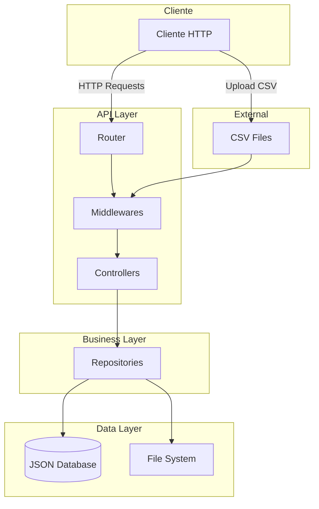

# Diagrama de Arquitetura - Visão Geral

```mermaid
graph TB
    subgraph "Cliente"
        C[Cliente HTTP]
    end
    
    subgraph "API Layer"
        R[Router]
        MW[Middlewares]
        CTRL[Controllers]
    end
    
    subgraph "Business Layer"
        REPO[Repositories]
    end
    
    subgraph "Data Layer"
        DB[(JSON Database)]
        FS[File System]
    end
    
    subgraph "External"
        CSV[CSV Files]
    end
    
    C -->|HTTP Requests| R
    R --> MW
    MW --> CTRL
    CTRL --> REPO
    REPO --> DB
    REPO --> FS
    C -->|Upload CSV| CSV
    CSV --> MW
```
