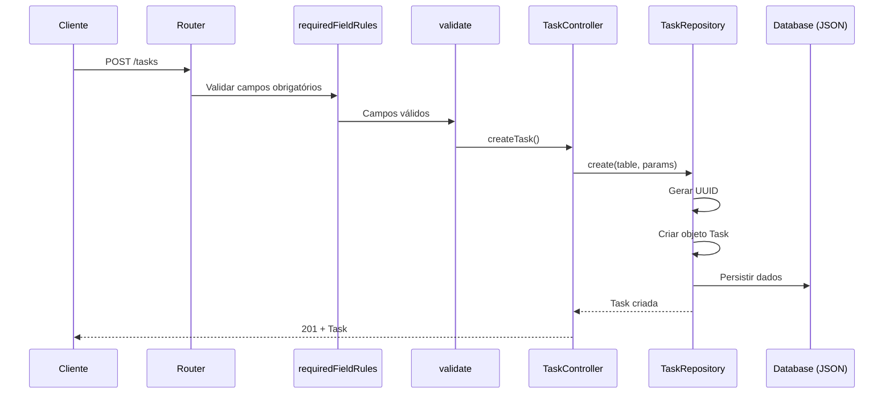

# Diagrama de Sequência - Criação de Tarefa

```mermaid
sequenceDiagram
    participant Client as Cliente
    participant Router as Router
    participant MW1 as requiredFieldRules
    participant MW2 as validate
    participant Controller as TaskController
    participant Repository as TaskRepository
    participant DB as Database (JSON)

    Client->>Router: POST /tasks
    Router->>MW1: Validar campos obrigatórios
    MW1->>MW2: Campos válidos
    MW2->>Controller: createTask()
    Controller->>Repository: create(table, params)
    Repository->>Repository: Gerar UUID
    Repository->>Repository: Criar objeto Task
    Repository->>DB: Persistir dados
    Repository-->>Controller: Task criada
    Controller-->>Client: 201 + Task
```
