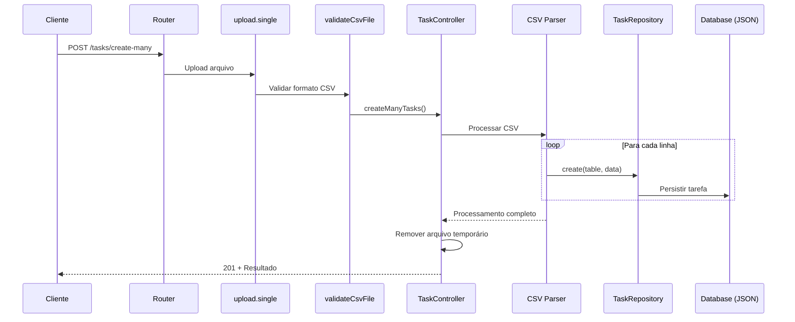

# Diagrama de Sequência - Importação CSV

```mermaid
sequenceDiagram
    participant Client as Cliente
    participant Router as Router
    participant MW1 as upload.single
    participant MW2 as validateCsvFile
    participant Controller as TaskController
    participant Parser as CSV Parser
    participant Repository as TaskRepository
    participant DB as Database (JSON)

    Client->>Router: POST /tasks/create-many
    Router->>MW1: Upload arquivo
    MW1->>MW2: Validar formato CSV
    MW2->>Controller: createManyTasks()
    Controller->>Parser: Processar CSV
    loop Para cada linha
        Parser->>Repository: create(table, data)
        Repository->>DB: Persistir tarefa
    end
    Parser-->>Controller: Processamento completo
    Controller->>Controller: Remover arquivo temporário
    Controller-->>Client: 201 + Resultado
```
