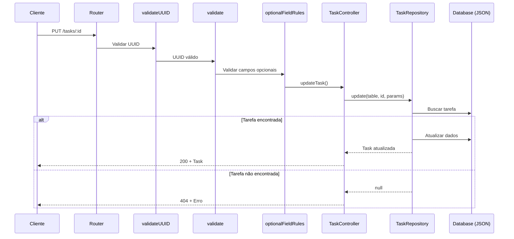

# Diagrama de Sequência - Atualização de Tarefa

```mermaid
sequenceDiagram
    participant Client as Cliente
    participant Router as Router
    participant MW1 as validateUUID
    participant MW2 as validate
    participant MW3 as optionalFieldRules
    participant Controller as TaskController
    participant Repository as TaskRepository
    participant DB as Database (JSON)

    Client->>Router: PUT /tasks/:id
    Router->>MW1: Validar UUID
    MW1->>MW2: UUID válido
    MW2->>MW3: Validar campos opcionais
    MW3->>Controller: updateTask()
    Controller->>Repository: update(table, id, params)
    Repository->>DB: Buscar tarefa
    alt Tarefa encontrada
        Repository->>DB: Atualizar dados
        Repository-->>Controller: Task atualizada
        Controller-->>Client: 200 + Task
    else Tarefa não encontrada
        Repository-->>Controller: null
        Controller-->>Client: 404 + Erro
    end
```
